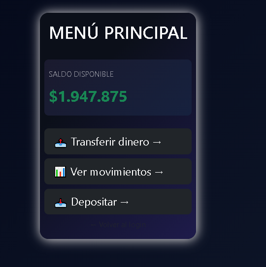
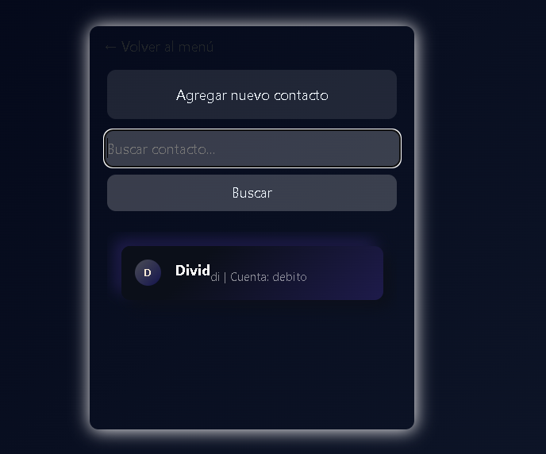
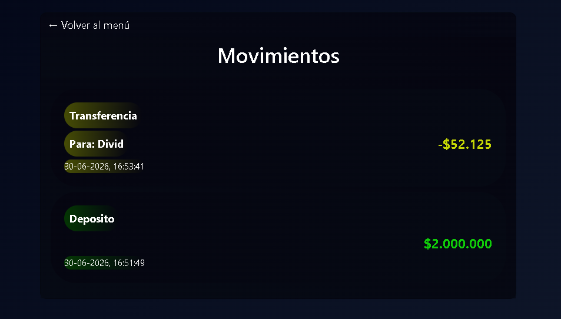
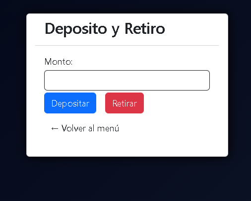

# Wallet-Alke

## Primera página web

Creando una fintech básica con funcionalidad con JS/jQuery, y estilos con CSS/Bootstrap.

## Sobre el proyecto

Alke Wallet es mi proyecto integrador del Módulo 2 (Fundamentos del desarrollo Front-end). Es un prototipo funcional que cubre lo pedido en la rúbrica: estructura semántica en HTML5, estilos con CSS y Bootstrap, lógica en JavaScript (manejo de saldo, depósitos y transferencias), interactividad con jQuery, historial de transacciones y todo versionado en GitHub con manejo de ramas.

No está 100% pulido, pero es una base sólida y funcional que demuestra el manejo de las herramientas del módulo.

### Estado del proyecto

Este proyecto es un **prototipo**, el cual implementa las funciones básicas de una billetera digital (transacciones, transferencias, historial, etc.), del lado del frontend, con localStorage.

#### Qué falta ajustar

- En `sendmoney.html`, el buscador de contactos achica el recuadro cuando no encuentra resultados — hay que arreglar ese detalle de responsividad.
- La paleta de colores actual es básica. A futuro busco rediseñarla, porque le falta más identidad "fintech".
- Reorganizar y cambiar estilos de botones para más identidad de "fintech".

### Uso de IA

Usé IA (Claude, Gemini) como apoyo durante el desarrollo, principalmente para resolver dudas conceptuales, debuggear errores y como guía en el flujo de trabajo con Git. El código y las decisiones del proyecto son propias.

Al ultimo hice una refactorizacion con la IA de GitHub. mejorar estructura y el orden para leerlo mejor en el futuro.

## Adjunto

**Menú principal**

**Agregar contactos**

**Historial de transacciones**

> **Hacer Depósitos y Retiros** 

